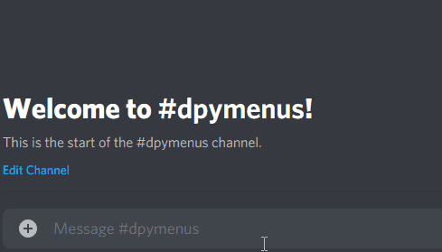

[](https://badge.fury.io/py/dpymenus)

# Discord Menus

`dpymenus` is an add-on for the `discord.py` library that lets you quickly compose stateful menus and polls 
which react to chat input (text, reaction buttons).


### Table of Contents
+ [Installation](#installation)
+ [Usage](#usage)
+ [Button Menus](#button-menus)
+ [Polls](#polls)
+ [Data Field](#data-field)
+ [Generic Input Matching](#generic-input-matching)
+ [Reaction Buttons](#reaction-buttons)
+ [Event Callbacks](#event-callbacks)
+ [Poll Utilities](#poll-utilities)
+ [Examples](#examples)

### Installation
`pip install dpymenus`

### Usage
Create a menu object *(it must take the Command Context as its first param)*:

    from dpymenus import TextMenu
    menu1 = TextMenu(ctx)
   
Add some pages to it *(a Page subclasses an Embed, so you construct it the same way with some additional parameters:
the `on_next` )*:
    
    await menu.add_page(title='Test Page', description=f'This is just a test!', color=discord.Color.green()
                        on_next=some_func_here)
    
Lastly, call the `open()` method on it:

    await menu.open()
    
...and you're *(mostly)* finished! A menu loop will spawn and handle user input when the command is 
called until it times out or is cancelled by the user. Note that you should have at least one Page
without a on_next. This denotes to the handler that your menu will be closed when you reach this page.

Your on_next method should call the `menu.next()` method whenever it has
successfully handled input. `next()` also takes 1 optional argument: 

`name`: jumps to a specific page by its function reference name. Useful for non-linear menus.

### Button Menus
You can also construct a menu which uses reactions as 'buttons' to handle user input.

    from dpymenus import ButtonMenu
    menu2 = ButtonMenu(ctx)
    
Similiar to a `TextMenu`, you need to add some pages. This time, we also need to pass in a list of buttons as such:

        await menu.add_page(title='Test Page', description=f'This is just a test!', color=discord.Color.green()
                        on_next=some_func_here, buttons=['\U00002600', '\U0001F315'])
                        
The buttons here are unicode, but you can use any Discord Emoji object. See the [Reaction Buttons](#reaction-buttons) section for
more details.

### Polls
The final type of menu you can construct is a Poll. Polls are slightly unique because they handle a lot of
functions internally. You can start the same as other menus:

    from dpymenus import Poll
    menu3 = Poll(ctx, timeout=60)
    
Note the timeout argument. This is the time, in seconds, before the poll ends. It defaults to 5 minutes.
    
    
It is important that you only add two pages here.
    
### Data Field
In addition to standard menu setup, an optional parameter called `data` can be defined for variables or objects you
want to pass around in menu functions. Note that `data` is managed internally by Polls, so you
should only be passing this in for a `TextMenu` or `ButtonMenu`.

State fields should be defined as a dictionary:

    my_data = {'username': None, 'favorite_color': None}

...and then passed into your menu on initialization:

    menu = Menu(ctx, data=my_data)

You can then access these like any objects attributes *(ie. `x = menu.data['value']`)*.

*As it is a dictionary, you can set more than strings. For instance,
transferring objects across functions by setting the value to an object. Ideally, the menu 
object should contain all your state until it is ready to be processed. This also simplifies
your code by limiting the amount of parameters functions need to accept when handling
multiple objects related to a single menu.*

### Generic Input Matching
The Menu class contains several generic values ready for matching against user input. These values
are generally universal, but should you wish to override them with your own values, there is a 
class method called `override_generic_values(value_type, replacement)` that can be called anywhere
in your code to replace them completely.

`value_type` is one of three strings: `'confirm'`, `'deny'`, or `'quit'`.

`replacement` is a tuple of strings containing your new values.

The defaults are:
```python
generic_confirm = ('y', 'yes', 'ok', 'k', 'kk', 'ready', 'rdy', 'r', 'confirm', 'okay')
generic_deny = ('n', 'no', 'deny', 'negative', 'back', 'return')
generic_quit = ('e', 'exit', 'q', 'quit', 'stop', 'x', 'cancel', 'c')
```

### Reaction Buttons
Here are some examples of how to acquire emojis in discord.py:
```python
btn1 = client.get_emoji(3487239849812123)  # guild emoji
btn2 = discord.utils.get(ctx.guild.emojis, name='example')  # guild emoji
btn3 = '<:example2:35434643573451>'  # guild emoji
btn4 = '\N{SNAKE}'  # unicode emoji as text
btn5 = '\U00002714'  # unicode emoji codepoint :heavy_check_mark:
```

### Event Callbacks
By default, the base Menu object implements methods for all events except `on_next`, which should
be handled by the user. However, all of these events can be overridden by passing in a method reference
when you instantiate your menu.

**Events**

`on_next` -- Called when the menu instance calls `.next()`. 

`on_fail` -- Called when user input on a page is invalid. Only usable in TextMenus.

`on_timeout` -- Called when a menu times out. You can set the `timeout` on menu instantiation.
 Only usable in TextMenus or ButtonMenus.

`on_cancel` -- Called when a menu is cancelled from user input. Only usable in TextMenus or ButtonMenus.


### Poll Utilities
Polls are a fairly complex Menu type, which often require a lot of boiler-plate to be written. dpymenus provides
a handful of quick utility methods on your Poll object that should make using them simpler and faster for basic
use case scenarios.

`.results()` -- Returns a dictionary where the keys are the poll choices, and the values are the final tally.

`.add_results_fields()` -- Adds all the result fields to your closing page.

`.generate_results_page()` -- Adds all the result fields to your closing page as well as calculates the winner or 
a draw.


### Examples
Example code has been moved into the *examples* directory above.
Can't find something you were looking for? Open an issue and I'll
try to add a relevant example!


